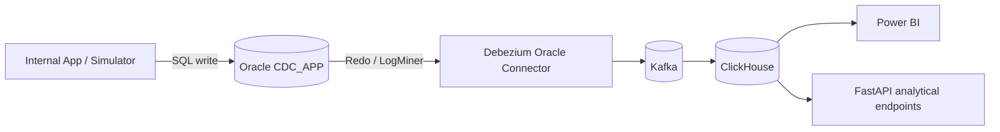
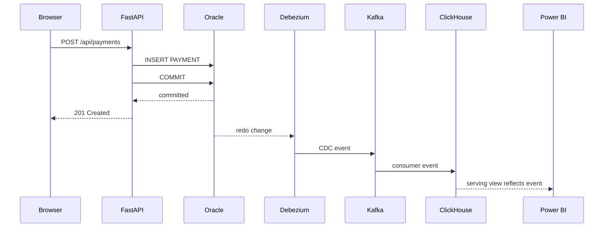
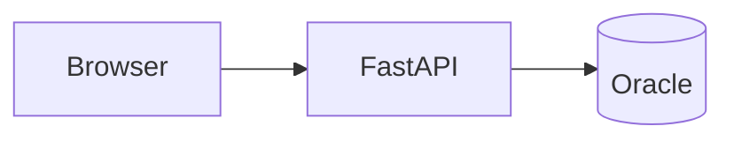
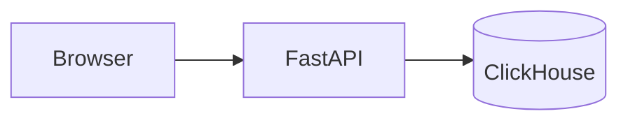
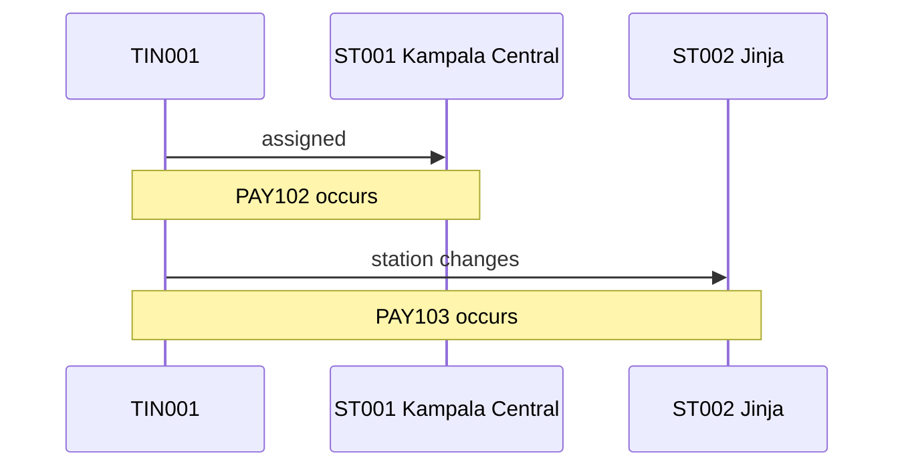
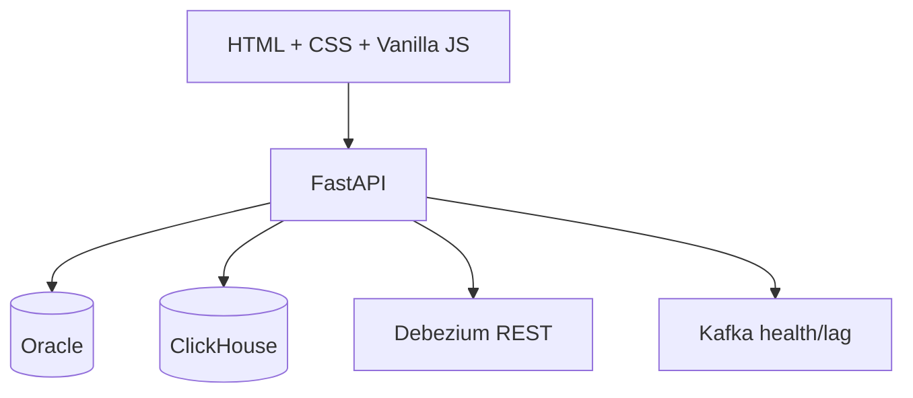

# Architecture

## 1. System overview

This POC demonstrates a realistic transactional-to-analytics architecture:



The core rule is that the source application writes only to Oracle.

The source application does not know that Kafka or ClickHouse exist.

---

## 2. Ownership boundaries

### Transactional/source side

Oracle owns the operational truth for:

```text
STATION
TAXPAYER
PAYMENT
```

The future FastAPI application reads and writes these entities directly in Oracle.

### CDC transport

Debezium owns extraction from Oracle redo using LogMiner.

Kafka owns durable event transport, offsets, buffering and replay.

### Analytical side

ClickHouse owns:

- append-oriented raw CDC history
- current-state projections
- taxpayer SCD2 history
- serving views
- fast analytical aggregation

Power BI and analytical API endpoints consume ClickHouse rather than querying Oracle for reporting workloads.

---

## 3. Write path



The API returns success after Oracle commit. It does not wait synchronously for downstream CDC.

---

## 4. Read paths

### Operational reads



Used by:

```text
Taxpayers
Stations
Payments
```

### Analytical reads



Used by:

```text
Dashboard
Reports
Event Monitor
```

### Infrastructure reads

Pipeline Health may inspect:

```text
Oracle connectivity
Debezium REST API
Kafka consumer groups / lag
ClickHouse connectivity and latest ingestion
```

---

## 5. Oracle CDC architecture

Oracle is configured with ARCHIVELOG and supplemental logging.

Debezium reads redo with LogMiner rather than polling source tables.

This matters because source application behavior remains normal SQL transaction behavior:

```text
INSERT
UPDATE
COMMIT
```

There are no application calls such as:

```text
publish_to_kafka()
write_to_clickhouse()
```

That separation is deliberate.

---

## 6. Dual Debezium topic strategy

Two connectors/topic families exist in the POC.

### Native events

Connector:

```text
oracle-cdc
```

Topics:

```text
oraclecdc.CDC_APP.PAYMENT
oraclecdc.CDC_APP.TAXPAYER
oraclecdc.CDC_APP.STATION
```

Purpose:

- full Debezium envelope
- before/after inspection
- source metadata
- forensic troubleshooting

### Flattened events

Connector:

```text
oracle-cdc-flat
```

Topics:

```text
oracleflat.CDC_APP.PAYMENT
oracleflat.CDC_APP.TAXPAYER
oracleflat.CDC_APP.STATION
```

Purpose:

- simple JSON ingestion into ClickHouse
- preserve CDC lineage without the Connect schema wrapper
- readable decimal values
- explicit delete state

The flattened event retains operation and source metadata such as:

```text
__op
__table
__source_scn
__source_commit_scn
__source_txId
__source_ssn
__source_commit_ts_ms
__source_user_name
__deleted
```

---

## 7. Kafka responsibilities

Kafka provides:

- durable buffering
- replay
- consumer offsets
- decoupling of source capture from analytical ingestion
- consumer lag as an observability signal

ClickHouse consumer groups include:

```text
clickhouse-oracle-payment-poc-v1
clickhouse-oracle-taxpayer-poc-v1
clickhouse-oracle-station-poc-v1
```

A healthy steady-state POC should normally return to lag 0.

---

## 8. ClickHouse layers

### Layer 1 — raw event history

```text
raw_oracle_payment_cdc
raw_oracle_taxpayer_cdc
raw_oracle_station_cdc
```

These retain versions rather than pretending each entity has only one row.

Example:

```text
PAY101 c PENDING
PAY101 u SUCCESSFUL
```

### Layer 2 — current state

```text
fact_oracle_payment_current
dim_oracle_taxpayer_current
dim_oracle_station_current
```

Current state is selected using source-derived version ordering.

### Layer 3 — history

```text
dim_oracle_taxpayer_history
```

This provides the station assignment that was valid during a business time interval.

### Layer 4 — serving

```text
vw_oracle_payment_analytics
```

This combines payment facts with both historical and current taxpayer/station context.

---

## 9. Point-in-time semantics

The distinction between historical and current dimension state is central to this POC.



Expected analytics:

```text
PAY102
station_at_payment = Kampala Central
current_station    = Jinja

PAY103
station_at_payment = Jinja
current_station    = Jinja
```

A join from every historical payment to only `dim_oracle_taxpayer_current` would be wrong because it would rewrite history.

---

## 10. Ordering semantics

Different timestamps and sequence fields serve different purposes.

```text
PAYMENT_TIME       business time
UPDATED_AT         source row/application time
source_commit_time Oracle commit time
kafka_timestamp    transport time
ingested_at        ClickHouse arrival time
```

The analytical current-state model must not select the latest record purely by `ingested_at`.

Source-derived ordering information includes:

```text
source_commit_scn
source_scn
source_ssn
kafka_partition
kafka_offset
```

ClickHouse ingestion time is useful for latency measurement, not source truth.

---

## 11. Failure boundaries

The architecture deliberately isolates source operations from analytics.

### ClickHouse unavailable

Expected:

```text
Payments CRUD      works
Taxpayer CRUD      works
Station CRUD       works
Dashboard          degraded/unavailable
Reports            degraded/unavailable
Event Monitor      degraded/unavailable
```

### Debezium unavailable

Expected:

```text
Oracle source operations continue
CDC falls behind
Pipeline Health reports degraded
Kafka/ClickHouse catch up after recovery
```

### Kafka unavailable

Expected:

```text
Oracle source operations continue
Debezium may pause/fail to publish
analytical propagation stops temporarily
```

Do not couple a successful Oracle business transaction to synchronous analytical availability.

---

## 12. Application architecture

The planned application remains intentionally lightweight:



Operational routes use Oracle.

Analytical routes use ClickHouse.

Infrastructure routes read status only.

---

## 13. Security architecture for the trusted POC

There is intentionally no login flow in this POC, but the API still has strict boundaries:

- no arbitrary SQL endpoint
- no arbitrary shell endpoint
- no credentials in frontend code
- no direct user-controlled Kafka publishing
- no secret files committed to Git
- Oracle bind parameters for user-supplied values
- technical exceptions logged server-side and translated to safe API errors

---

## 14. Production considerations outside this POC

This repository is a POC, not the final production topology.

Items that would need separate production design include:

- authentication/authorization
- TLS and ingress/reverse proxy
- production secrets management
- multiple Kafka brokers
- high availability
- ClickHouse topology/replication
- Debezium connector HA and operational policy
- schema evolution governance
- monitoring/alerting platform integration
- capacity planning

These should not be prematurely added to the POC unless they are explicitly part of a new objective.
